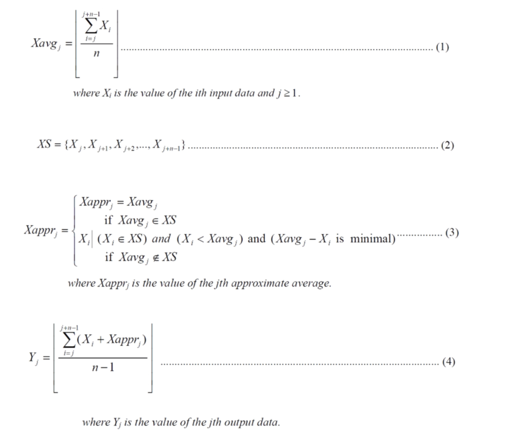

# Digital IC Design

## Approximate Average

### Introduction
- Please design a computational system whose transfer function is defined as follow. A series of 8-bit positive integer is generated as the input of the computational system by the test bench. The output value Y is a 10-bit positive integer, which is calculated according to equations (1), (2), (3) and (4).

## AUTHORS
[Yu-Tong Shen](https://github.com/yutongshen/)
